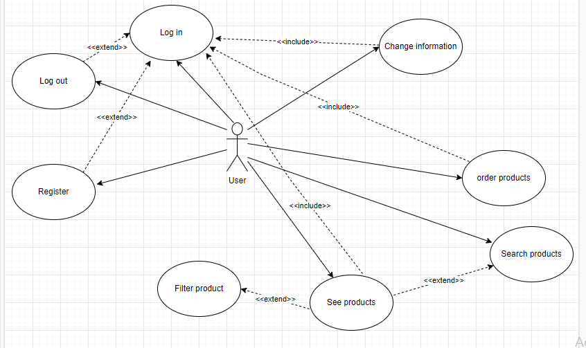
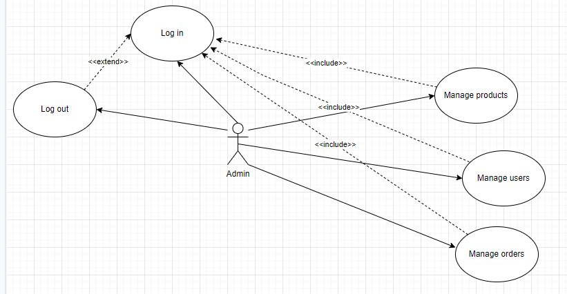
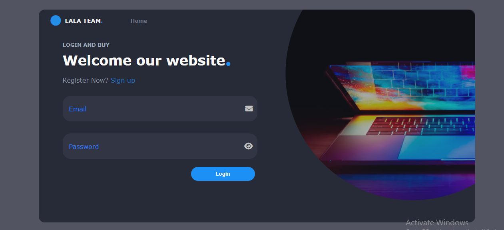
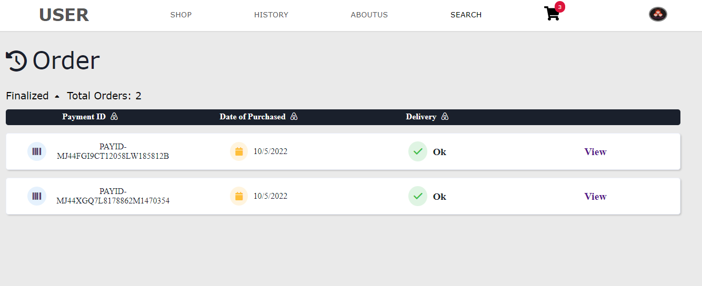
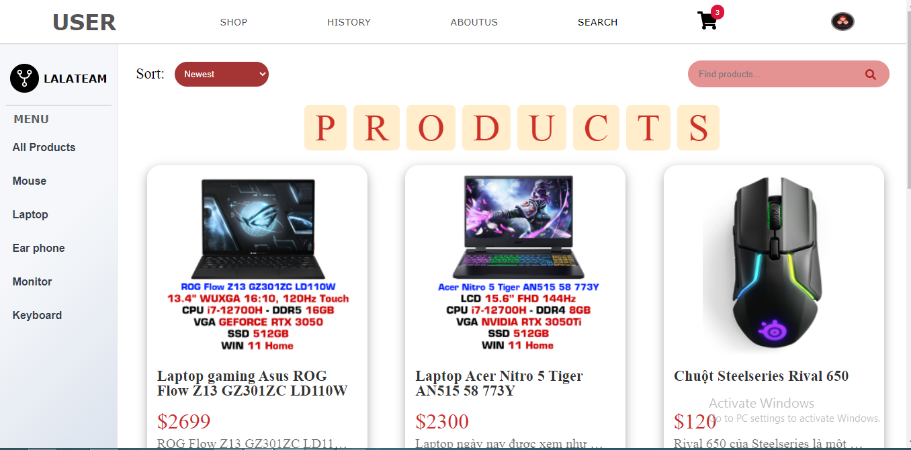
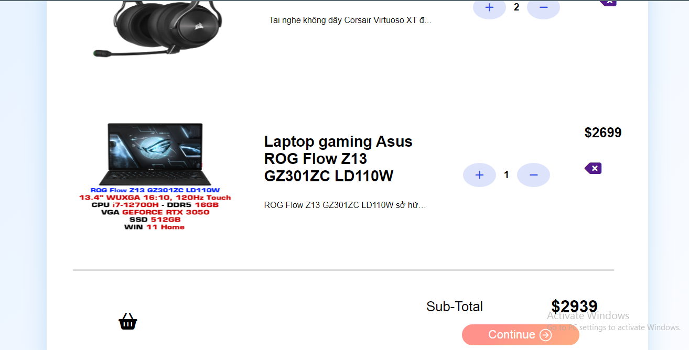
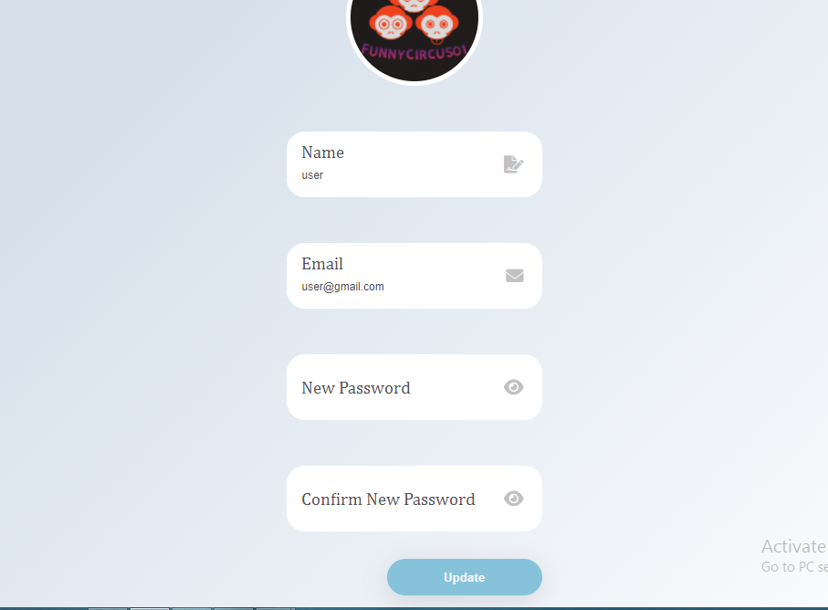
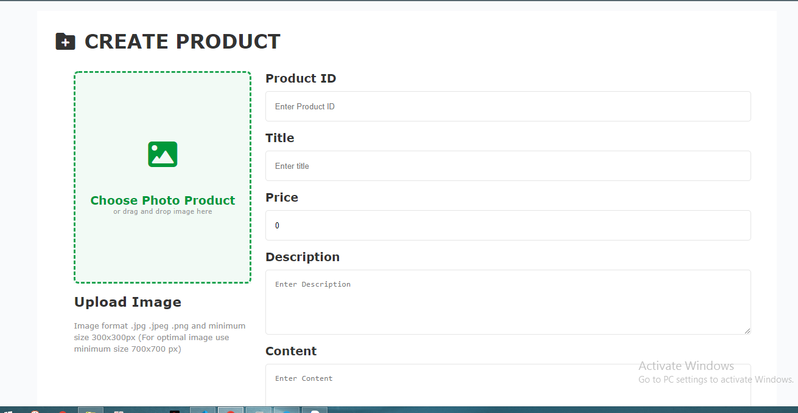

# Team : LalaTeam
# Topic : Laptop Shop
# Motivation:
We were inspired to build a large-scale laptop sales site in the future, so we made this project. This project is the first foundation and will be developed with more features in the future
# Team member.: 
Bùi Đăng Khoa(backend,frontend)
Thài Gia Lạc(frontend)
# Technology  : 
Frontend: redux-toolkit, html ,css,reactjs
Backend: nodejs ,mongodb
# Use Case:
- UserUsecase

- Admin useCase:

# UI
# Login page

# Order page

# Product page

# Cart page

# Profile page

# Manage Product page

## Features
gg

